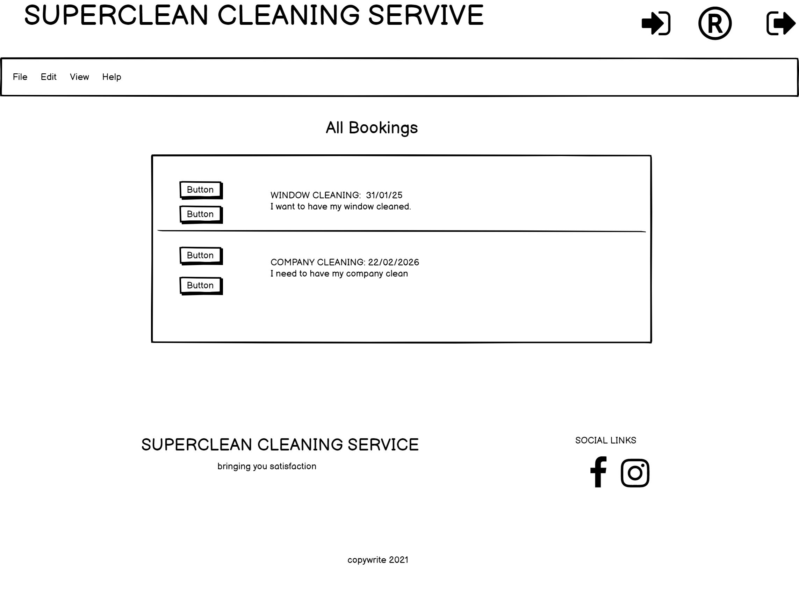
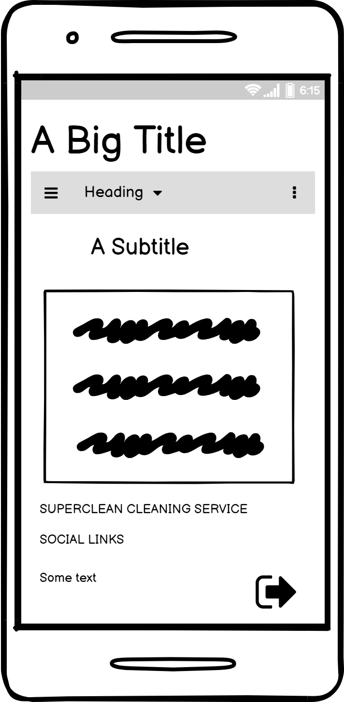

# Superclean Booking Service

* This is a project built using, Html, Css, Materializecss, Javascript, MongoDB, Flask and Python.
* it contains a header elament which contains the **Sign In Button** for users to sign into their accounts. **Register button** for users to create an account and **Sign Out buttons** that signs the users out from their accounts.
* it also has a **Navigation Bar** that contains the Navigatation Menu such as **Home**, **Book A Clean**, that provides an option for users to select from the different cleanings for the users to choose from and **Profile**, that displays the users profile.
* On the footer, there is a **Sign out** button which is displayed only on small devices.

# UX
* The site is meant for users who want to book a cleaning or want to book the service from a cleaning company. The user can achieve the possibilities of creating, updating, deleting data from the database. The site provides the user with a menu that contains a **Book A Clean** option for the users to book their cleanings.
* As a user i can also delete informations by clicking on the delete button which will popup a message, asking the user to confirm the deleting process.
* As a user i can also update informations by clicking on the update button which will redirect the user to an updating form. On the form, the user can either cancel or continue with the update.

### Desktop view

### Mobile view

# Features
In this section i will describe the different parts of the project.

## Existing Features
* The header contains the TITLE, SIGNIN, REGISTER AND LOGOUT
* The SignIn contains a signin form which has a **username** and **password** for users who have already created an account to sign into their accounts.
* The SignOut allows users to sign out of their accounts.
* The register contains a form that has a **username**, **password**, **confirm password** for users to create an account.
* The navigation bar contains a **Home**, **Book A Clean** and **Profile** menu.
* The **Home** contains all the bookings. And still on the home page, the user can **delete** or **update** informations they have created.
* The **delete** button when clicked asked the user to confirm the delete process.
* The **update** button redirects the user into an update form for the users to update the information. The update form has **cancel** and **update** buttons.
* The **cancel** button cancels the process and redirects the user back to the home page, while,
* The **update** button, confirms the users update.
* The **Book A Clean** provides a form for users to edit their booking. It has a **choose an option** for users to choose from the different cleanings. A **Task description** for users to describe elaborately what they want the company do for them. A **date** when they want their cleaning. An **address**, where to fill in their address, A **phone number** where to put their number and a **button** to click if the cleaning is urgent.
* Finally the **profile**, which shows the user's profile.

### Tecnology used
* **CSS,HTML,JS and PYTHON**
* **Materializecss** Is a framework used entirely to build the site. [Materializecss](https://materializecss.com/showcase.html).
* **MongoDB** Is the datebase that store the informations [MongoDB](https://www.mongodb.com/)
* **Flask** containS templating languages such as jinga and werkzeug that python is dependent on to function properly. [Flask](https://flask.palletsprojects.com/en/1.1.x/) 
# Testing
### BOOK A CLEAN:
* Go to the "BOOK A CLEAN" page
* Try submitting an empty form, an error message appears on the required fields saying "please fill out the fields"
* Try filling the field with informations, the line turns green indicating the field has the required information.
* Try leaving the the field without filling the information, it turns red indicating no information present.
* Try filling all the fields and submitting it says "Booking Successful" and redirects you to the home page.
### Home
* Go to the "HOME PAGE"
* Try clicking on the delete button, it popsup a message "Are you sure you want to delete this post" 
* Try clicking on the delete on the popup message, it deletes the message and flashes "Booking Successfully Deleted".
* Try clicking on the cancel button, it cancels and redirects you back to the home page.
* Try clicking on the update button it opens the form to be updated.
* Try clicking on the cancel button on the updated form, it brings you back to the home page.
* Try updating the form and click on the update button, it flashes a message "Booking Successfully Updated" and redirects you back to the home page.
* Try clicking the profile button which displays the users profile.
* Try clicking on the LOGOUT button, it logs the user out of his/her account and flashes a message "You have been logged out".
### ON different screen Sizes
* On larger screens, the TITLE, SIGNIN, REGISTER and SIGNOUT buttons are displayed on the right, meanwhile, on the navigation menu, the HOME, BOOK A CLEAN and PROFILE are displayed to the right. The PROFILE is only displayed when the user is logged in.
* On smaller screens, the Title occupies the full width, meanwhile the SIGNOUT button is displayed on the Footer of the page. The Navigation menu icon is on the right and when clicked displays the menu from the right which contains the HOME, BOOK A CLEAN, PROFILE AND LOGOUT.

# Deployment
* The project was deployed to Heroku through the following stages.
* Firstly, I setup some files heroku needs to run my app, they are called dependencies such as requirments.txt and Procfile. Then,
* Go to Heroku and click on click on the button, "NEW", it provides you with an option to "Creat new app", click on it.
* Fill in the App Name and your region or region you are closest to, then click on "Creat App" button.
* To connect the App, we can use Automatic Deployment from our GitHub repository by clicking on the "GitHub Connect to Github", it displays your GitHub profile then add your repository name then click the "Search" button.
* When it finds your repo, click connect.
* Click on "settings" tap on your app and click on "Reveal config vars". Fill in the IP, PORT, SECRET_KEY, MONGO_URI, And finally the MONGO_DBNAME
* Go back to your terminal and push your code to the master branch by typing. git status, git add -A, git commit -m "comments", finally git push.
* Then, Go back to Heroku and "Enable Automatic Deploys" and then click "Deploy Branch" which will take a minute or two to build app.
* Once is done you will see, "your app was Successfully deployed".
* The deployed site is now available and will automatically update when ever we push changes to the GitHub repository.
* Here is a link to my deployed App. [https://git.heroku.com/booking-times.git](https://git.heroku.com/booking-times.git)

# CREDIT
* I owe a big thanks to all those who supported me in one way or another.
* Some ideas were obtained from materials at code institude.
* Meanwhile, some ideas where obtained from a video i watched on [utube](https://www.youtube.com/watch?v=u0oDDZrDz9U&t=2531s).

### Media
* The background photo was obtained from Can Stock Photo.

### Acknowledgements
* My inspiration came from a cleaning company website. When trying to understand how users where able to book their cleanings.
